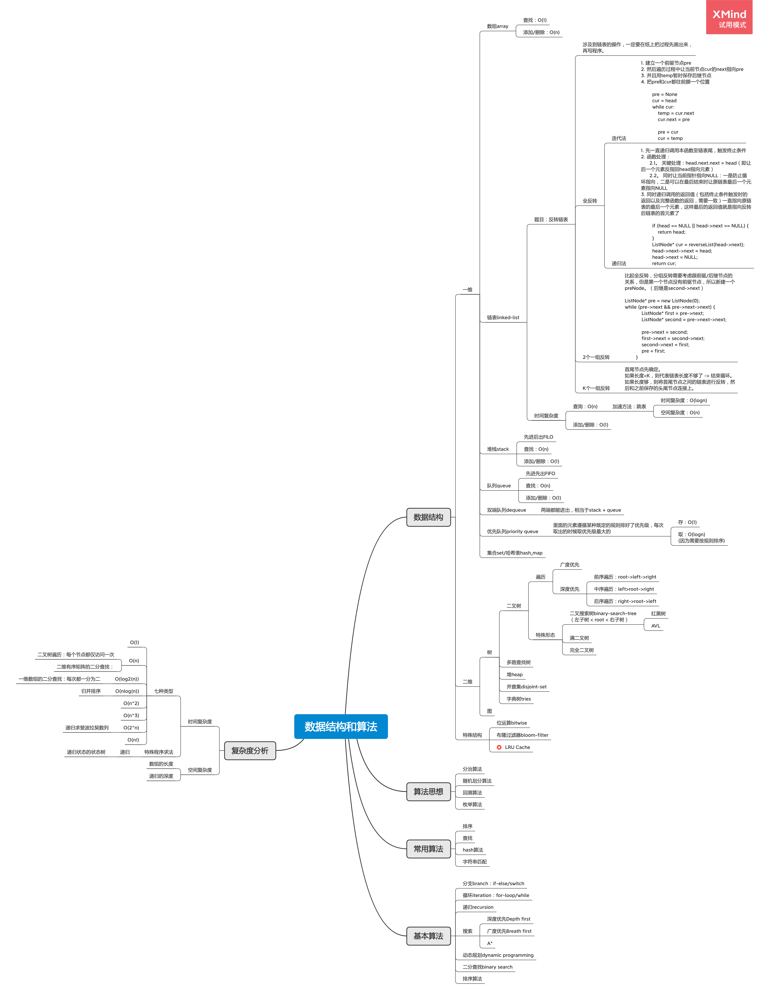

## 学习笔记

### 1. 脑图（持续更新中）
按照老师的建议，将每周学习的内容，以及所对应题目中，自己做过的不够熟练或者认为比较重要的题目的核心代码以脑图的形式记录下来了。

这样的话，确认能够在复习的时候通过脑图直击重点内容，并且通过核心代码在自己脑中能够快速复现原题以及解法。

### 2. 课堂笔记

### 3. 刷题感想
#####刷题误区①
目前刷题时还是没有能够完全贯彻“五毒神掌”，有些题目在第一遍刷题时，15min内把逻辑想到了一半，就认为自己能够想出来，然后再继续想结果发现其实自己做不出来，但是时间可能不知不觉已经过了1个小时甚至更多，结果还是要去通过题解来解决。
##### 刷题误区②
看题解的时候，有时候容易死磕。比如有些题解能看懂怎么实现的，但是为了去追究怎么想到这种方法而耗费大量时间，然后就没精力再去做更多的题。
现在一周课上讲解题+课后习题+作业=大概20多题，用五毒神掌去刷需要很多时间，目前基本每道题上平均要花1～2个小时。