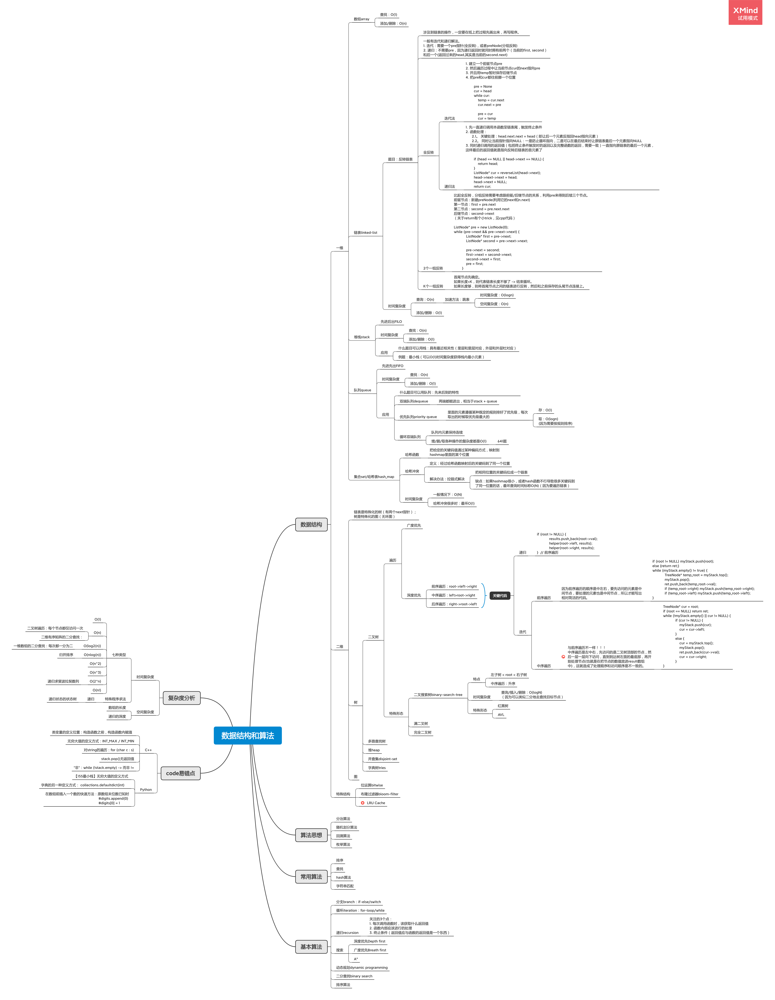

## 学习笔记

### 一、脑图（持续更新中）
本周更新内容：
- 基本算法/递归: 三个做题原则
- 基本算法/递归&分治: 解题代码模版

### 二、关于二叉树的题目心得
要熟悉前序、中序遍历的特点，才能更好地利用其特性来解题。
#### - 前序遍历: root -> 左子树 -> 右子树
即遍历得到的数组中，首元素的root.val，之后的序列是其左子树的所有元素，左子树全部完了之后才是右子树的所有元素
#### - 中序遍历: 左子树 -> root -> 右子树
即遍历得到的数组中，首先是其左子树的所有元素，然后中间的root.val，再之后是右子树的所有元素
